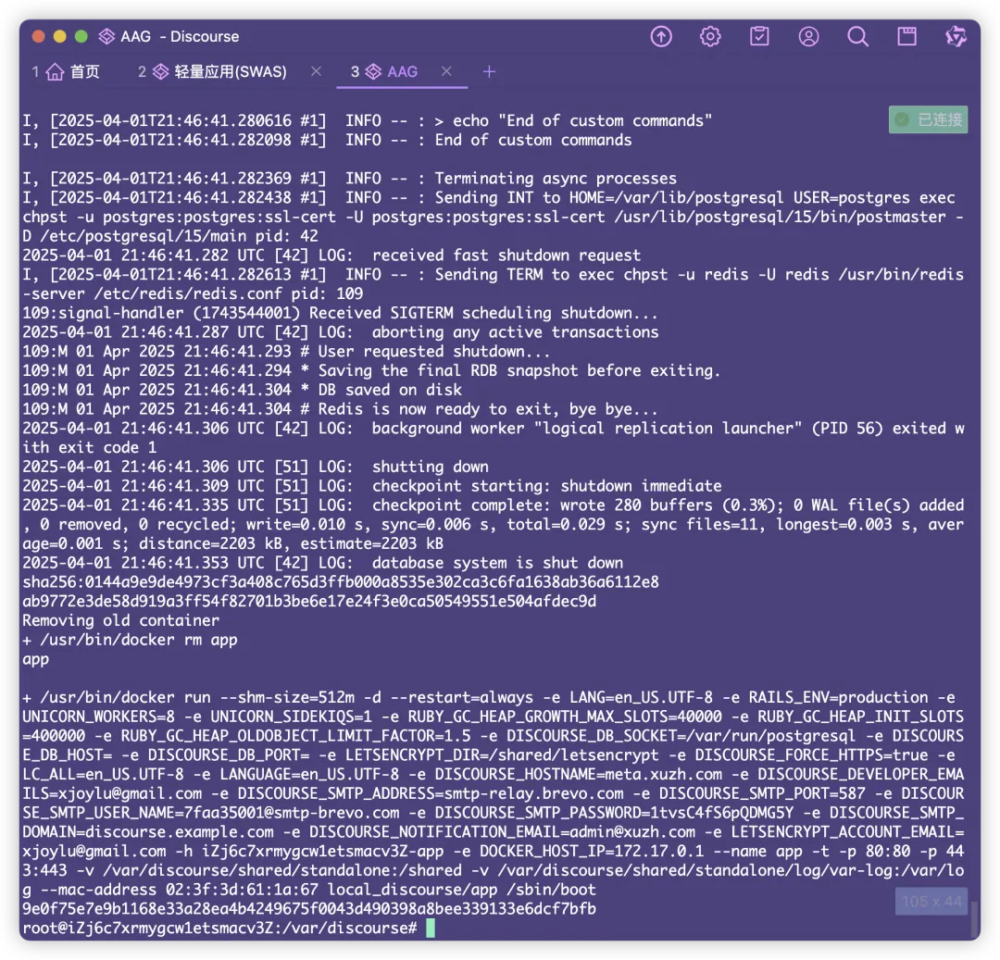
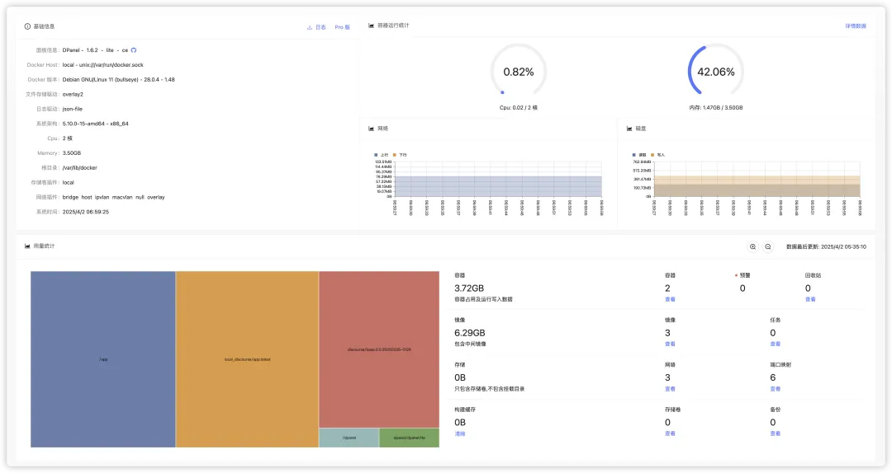

# 部署 Discourse 并安装 Dpanel 监控

半夜睡不着，打算部署个 Discourse 折腾下消耗精力，没想到直接天亮，记录下流程，权当笔记。
## 准备工作
### 1. 域名
> 🔔 Discourse 无法通过 IP 地址运行，您必须得拥有一个域名才能example.com继续。

> 如果使用 cloudflare 解析的话，需要把代理改为仅DNS，否则无法识别 443 端口

域名直接 A 解析到服务器 IP
### 2. 邮件服务箱
>  ⚠️ Discourse 中的帐户创建和通知都需要用到邮件。引导前没有配置的话，会导致无法激活账户！
这里列出两个参考：
* **Brevo**，官方推荐的邮件服务商之一，每日有 300 封额度，基本够用
* **阿里云邮箱**，本土化，有问题方便工单
## 安装流程
### 3. 创建云服务器
官方文档推荐的是，**Ubuntu Server LTS** ，配置要求 2G RAM 以上，实际构建时要求更高
我选用的服务器配置是阿里云的轻量（2h4g），初始开始构建的时候使用 Ubuntu ，但总在构建中内存爆满，阿里云的工作人员回复建议购置更大的服务器：D
我最后更换了系统，采用 Debian，并且设置了内存交换，按照红帽的标准，我设置了8G的交换空间，最终顺利完成安装。[^1]
### 4. 连接服务器
一般使用 SSH 连接服务器
`ssh root@192.168.1.1`
然后安装软件包
`sudo apt install docker.io`
`sudo apt install git`
### 5. 安装 Discourse
将官方的 Discourse Docker 克隆到 /var/discourse。
`sudo -s
git clone https://github.com/discourse/discourse_docker.git /var/discourse
cd /var/discourse
chmod 700 containers`
### 6. 编辑 Discourse 配置
启动安装工具
`./discourse-setup`
出现提示时回答以下问题：
`Hostname for your Discourse? [discourse.example.com]:
Email address for admin account(s)? [[me@example.com](mailto:me@example.com),you@example.com]:
SMTP server address? [smtp.example.com]:
SMTP port? [587]:
SMTP user name? [[user@example.com](mailto:user@example.com)]:
SMTP password? [pa$$word]:
Let's Encrypt account email? (ENTER to skip) [[me@example.com](mailto:me@example.com)]:
Optional Maxmind License key () [xxxxxxxxxxxxxxxx]:`
静候 5～10 分钟，完成安装！

### 7. 配置管理员账号
## 部署 Dpanel
部署 Dpanel 的过程相对简单，主要是方便查看项目情况
### 8. 脚本安装 Dpanel
sudo curl -sSL [https://dpanel.cc/quick.sh](https://dpanel.cc/quick.sh) -o quick.sh && sudo bash quick.sh
等待约 5 分钟左右，就可以登录了

其中 /app 就是 Discourse
## 参考资料
### 9. 参考网站
* [Discourse 官方论坛](https://meta.discourse.com/)

### ⠀10. 参考文档
* [Discourse的自动化部署](https://kejinlu.com/2013/05/discourse-install-guide/)
* [初学者 Docker 安装 Discourse 指南](https://github.com/discourse/discourse/blob/main/docs/INSTALL-cloud.md)
* [🇨🇳 Detailed installation guide + control panel | 超级详细教学安装discourse+控制面板](https://meta.discourse.org/t/detailed-installation-guide-control-panel-discourse/278426)
* [在新安装的 Discourse 中解决电子邮件问题](https://meta.discourse.org/t/troubleshoot-email-on-a-new-discourse-install/16326)

⠀[^1]: [Linux 中交换空间 （swap）应该分多大才好？](https://www.cnblogs.com/pipci/p/13021241.html)
