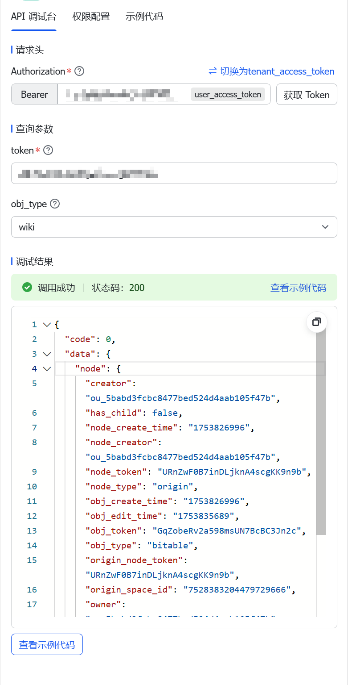
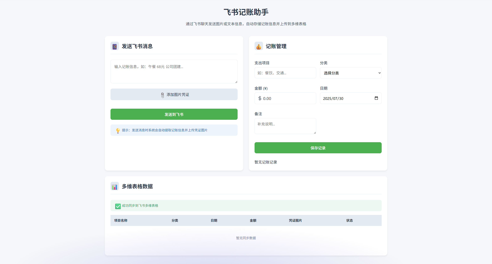

# 一句话记账机器人｜用飞书 + 多维表格撸一个最小MVP

## 1. 背景介绍

为什么想做一句话记账机器人？

作为偷懒界翘楚，我本身对记账这种琐碎事宜自来是深恶痛绝的。但无奈合伙开了「无所事事」店铺，各项支出甚多，为了对自己和小伙伴都有个交代，于是开始记录店铺各项支出，也方便后续复盘。

在企微、钉钉、飞书这国内 OA 御三家中，我最爱的是飞书。飞书给我的观感，是这三家中最有互联网氛围的产品，其他两个更像是 Boss 管理工具。飞书在权限、功能生态、设计上更亲民，细节不赘述。

其实我一开始是 Notion 的狂热爱好者，新型数据库/多维表格的概念最早就是在 Notion 中体验到的（鼻祖其实是 Airtable）。但因国内网络环境及部分 OA 工作原因，我逐步迁移到飞书。如今飞书生态逐渐完善，体验已不逊于 Notion，甚至本地网络表现更佳。

## 2. 功能需求

作为前产品经理，现在基本通过 Vibe Coding 来完成这类突然冒头的 MVP 项目，但在脑子里过一遍产品流程依然是输出 Prompt 的好方式。

### 目标场景

采购平台繁多，信息记录繁琐。经常需要截图再手动输入，还常用手机操作。希望通过机器人自动化简化流程。

### 实现思路

```
用户发送消息
       ↓
机器人接收消息
       ↓
解析消息内容（正则 or 关键词提取）
       ↓
验证字段完整性和格式
       ↓
调用飞书多维表格 API 写入数据
       ↓
发送确认回复给用户
```

- 支持文字/图片输入
- 自动写入多维表格
- 图片自动上传到附件字段

## 3. 技术方案

### Step 1：创建飞书机器人

1. 登录 [飞书开放平台](https://open.feishu.cn/)
2. 新建机器人，获取 `AppID` 和 `AppSecret`
3. 配置事件订阅，绑定服务器回调地址
4. 获取目标表格的 `spreadsheetToken` 和相关权限

### Step 2：事件监听与解析消息

- 注册 `im.message.receive_v1` 事件监听
- 接收用户消息（含文字、图片）
- 正则或关键词提取字段内容
- 调用多维表格 API 写入数据



## 4. 代码实现（PHP 示例）

```php
// ⚙️ 配置项
$app_id = 'cli_XXXXXX';
$app_secret = 'XXXXXX';
$app_token = 'bascnXXXXXXXX';
$table_id = 'tblXXXXXXXXXXXX';
```

- 通过飞书聊天发送图片（或一句话）    
- 实现记账信息自动存储与管理
- 自动上传图片到多维表格附件字段

这里我太懒了，直接贴代码，可以看备注

[附源码](./feishu_bookkeeping_bot/feishu_bot)

### 参考资料

- [快速调用服务端 API（创建一个多维表格）](https://open.feishu.cn/document/introduction-2)
- [多维表格 API 调试台](https://open.feishu.cn/document/server-docs/docs/bitable-v1/app/create?appId=cli_a80382893afb5013)
- [获取多维表格参数](https://open.feishu.cn/document/server-docs/docs/wiki-v2/space-node/get_node?appId=cli_a80382893afb5013)
- [列出字段](https://open.feishu.cn/document/server-docs/docs/bitable-v1/app-table-field/list?appId=cli_a80382893afb5013)

### 常见问题排查

| 问题 | 解决方案 |
|------|----------|
| 无法收到消息 | 确认事件订阅配置正确，且公网可访问 |
| 无日志生成 | 检查 PHP 目录写权限，确保日志写入代码未被注释 |
| 写入失败 | 查看日志中 Bitable 返回的报错信息 |
| 回复失败 | 检查 `reply_msg` 权限 & `tenant_access_token` 是否有效 |
| JSON 错误 | 飞书请求体格式需符合 API 要求 |

## 5. 部署流程

- ✅ 安装 PHP 和 curl 环境（可切换其他语言）
- ✅ 使用 HTTPS 公网地址托管回调服务
- ✅ 在飞书后台配置机器人权限与事件订阅
- ✅ 日志监控（建议每日观察 log.txt）
- ✅ 启动服务 → 发送测试消息 → 成功写入表格


## 6. 调试心得 & 踩坑总结

1. **飞书的权限分配很复杂**：比如 Wiki 和 Base 分别需要不同的 token，尤其 Wiki 还需解析出 `obj_token`
2. **日志机制是救命稻草**：别偷懒，写日志能救命！
3. **不同场景下接口调用差异大**：一定要根据实际接口的返回仔细排查。

## 7. 后续扩展计划

目前这个 MVP 已经可用，但也有很多值得优化的地方，先列出来，等我哪天有空：

- ✅ 支持语音输入（结合苹果捷径）
- ✅ 多字段自动识别
- ✅ OCR 提取图片中的文字（开发中）
- ✅ 数据可视化报表
- ✅ 用户权限控制
- ✅ 前端界面美化（见下图）



---

系甘先～咗你五分钟 😌