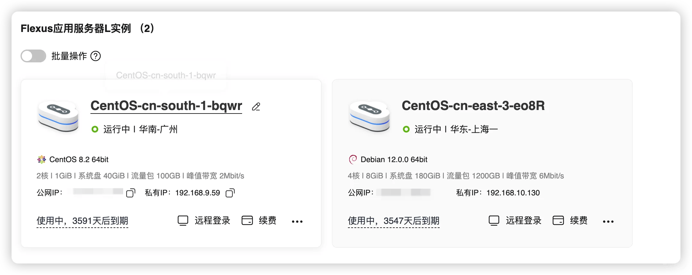

# 📩 思路周刊 · 第 7 期  ｜ 重新上路的一次回归，以及未完成的记录计划
*2025.07.20 · 中山*

---

## 🗓️ 开场白｜无所事事了一年半

在忙碌与疲倦之间，我无所事事地度过了又一段时间。直到最近翻出后台草稿，才想起来「思路周刊」还留着空档的第 7 期。

我曾经想写一个“科技观察者”的周刊，但显然，那种效率与热情已经过去。  
现在的我，想记录的是：

- 自由职业的日常  
- 工具实验的感受  
- 脑袋里停不下来的小思路  
- 与现实拉扯的缝隙与浪漫  

这是一次小小的转向，也是一种慢慢找回表达节奏的尝试。

---

## 🧰 活动进阶｜和朋友一起做了「泛Fun｜乐在其中」

我们做了一个轻社交类活动小程序：**泛Fun｜乐在其中**

初衷很简单 —— 社交似乎是永恒的需求，而我们只希望它好玩、可持续。  
盈利不重要，只要能让用户愿意支持服务器成本就好。

🔍 **体验方式**：微信内搜索「泛Fun｜乐在其中」  
📮 **欢迎合作**：我们欢迎甲方爸爸 & 场地活动主理人联络洽谈！

---

## 🌱 日常记录｜计划摆烂，意外忙碌的一周

- 这周接待了两次包场，还有排期在路上。暑假一到，店铺突然忙了起来，打乱了我原定“躺平计划”。  
- 激活了澳门红卡，但限速严重，感觉只能看看文字资料。用起来像回到了千禧年。  
- 修复了心心念念的墙体漏水，总算能重新安排桌游排行榜相关内容。  
- 骑摩托去了趟深圳，一路风大，但心情轻松。  
- 参加了一个打着小红书旗号的线下会，内容老旧、套路满满，基本无收获。  
- 游泳初见成效：已经能熟练仰泳啦！

没有 KPI，没有通告，偶尔也会焦虑。  
但更多时候，是慢慢知道自己真正想写的是什么。

---

## 📚 灵感角落｜本周推荐

- **[yiju.city](https://yiju.city)** ｜发现宜居城市，自由生活工作  
  - 参考城市中的星巴克、三甲医院、迪卡侬数量等数据来判断宜居程度  
  - 这其实是我很早想做但搁置的一个点子，他们参考维度更细，也许这正是我没做下去的原因  

- **[Fake-word](https://fake-world.devdoll.icu/)** ｜高仿微信 + AI  
  - 用 React + TailwindCSS + Jotai 构建，甚至能生成 AI 聊天记录，适合做交互类创意项目  

- **[虫部落](https://chongbuluo.com)**  
  - 老牌的搜索引擎导航聚合，适合信息检索爱好者  

- **[开源项目导航](https://chencoding.top:8090/#/)**  
  - 如果你想参与开源项目，可以从这里看看有没有合适的切入点  

- **[腾讯云 EdgeOne](https://trtc.io/?ref=joy)**  
  - 出海版 CDN 服务，比 Cloudflare 更适合国内站点  
  - 最近赠送了一个域名额度，我配置给博客试试，体验意外不错  

- **[图标加速服务](https://icons.xuzh.com)（已开源）**  
  - 失眠夜临时起意，做了个图标加速 CDN，已开源到 [GitHub](https://github.com/xJoyLu/IconDeck)

- V2 站长基于 AI 做了一个肉鸽游戏
  - 细节不是很丰富，但是属于正常游玩的作品了，看来我的游戏也要加快步伐了，AI 分担了大量素材制作的工作，再拖就纯粹是菜和赖了！
  - 体验地址：[Banny](https://banny.iweb.eth.sucks/)

---

## 🧱 序章事务｜小而坚定

为了让「序章」项目能稳定运行，我手动续费了服务器 **10 年**。  
没别的意思，就是不想看到「你的网站即将关闭」这种提示。

最低战斗十年，不打烊。

---

## 🎬 本周观影推荐｜《深夜加油站遇见苏格拉底》

> 英文片名：《Peaceful Warrior》

几句话记下来，留作提醒：

- 幻象：生命本身是个谜团，别花力气去了解。  
- 幽默感：尤其是和自己有关的事，保持幽默感，这是所有力量的来源。  
- 改变：没有事物能永远保持不变。  

保持热爱，专注当下，享受旅程，而不是结果。

---

## 📬 尾声｜思路回归中

感谢你还订阅了「思路周刊」，或者哪怕只是偶然点开这个链接。

以后我会尽力每周写一次，不为了流量，也不为了变现，  
只为让自己不迷路。

> 欢迎回来，  
> 下一期见 🌙

---

**卢东东**  
偷懒界翘楚的情书 @ 思路周刊  
📬 xjoylu@gmail.com  
🌐 博客 & 往期归档：https://ldd.cc